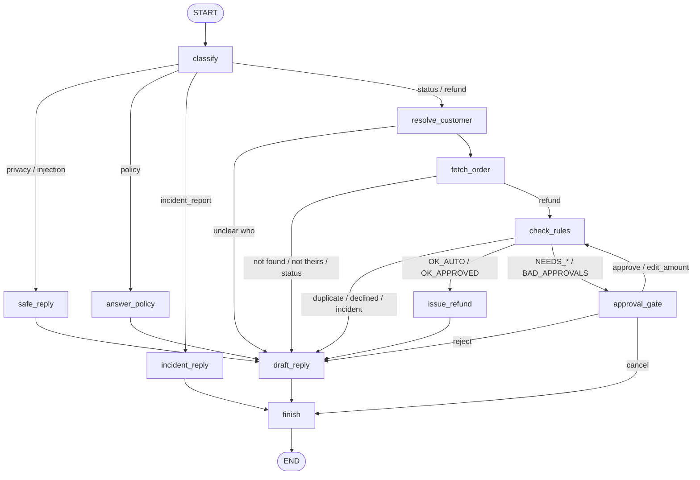
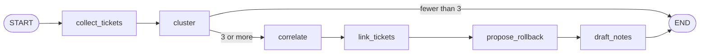

# OpsDesk Standard - Architecture

## 1. Layers and the one-way dependency rule

```
 run_queue.py  (orchestration, printing)
      │ uses
      ▼
 agent/        LangGraph graphs + nodes + LLM seam          ── MCP client ──┐
      │ imports ONLY: common.rules, common.db.today,                          │ stdio (3 processes)
      │ common.templates, common.config                                       ▼
      │                                                    servers/  3 MCP servers (thin)
      ▼                                                          │ imports
 common/       config, db, rules, masking, templates,            ▼
               repositories (SQL), stores (files)         common/ (same package)
      │
      ▼
 data/ (files)   +   opsdesk.db (SQLite)
```

* `common/` never imports `servers/` or `agent/`.
* `servers/` never import `agent/`. They contain no business rules; they call `common/rules.py`.
* `agent/` talks to data ONLY through MCP tools (so least-privilege and masking are enforced server-side). The few
  `common` imports it has are pure functions (rules, clock, templates), never database access.

## 1b. Web layer (optional)

```
 React + Vite UI (frontend/)  ── HTTP /api ──►  FastAPI (app/api/)  ──►  the same agent graphs + MCP tools
   components, views, hooks                      routers: config, tickets,       (no logic duplicated)
   api/client.ts is the only fetch()             approvals, incidents, admin
```

* The API reads data through the MCP tools using a restricted tool belt that does **not** include `issue_refund` or
  `propose_rollback`: money moves only through the agent graph.
* A paused approval is stored in memory with its `thread_id`; `POST /api/approvals/{thread_id}` resumes the same graph thread.
* API keys never travel through the API or the browser; they are read from `app/.env` on the server.
* No authentication in this demo (see README).

## 2. Who owns what (corporate view)

| Component | Real-world owner | Why it is separate |
|---|---|---|
| `servers/orders_server.py` | Support operations | Support tools must not read production logs |
| `servers/knowledge_server.py` | Policy team | Serves only `data/policies`; internal rules unreachable |
| `servers/ops_server.py` | Platform / SRE | Ops tools must not issue refunds; only writes are incident links and rollback *proposals* |
| `common/rules.py` | Finance + Support policy | One source of truth for money decisions |
| `agent/` | Customer Operations Platform | Decides *what to do next*, never *what is allowed* |

## 3. Graph A - one ticket (11 nodes)



`approval_gate` calls `interrupt(card)`. The caller resumes with `Command(resume=answer)` on the **same thread_id**
(`agent/runtime.py`). LangGraph re-runs the node from its top on resume, so the node is written to be repeatable
(the status update is idempotent, the card is rebuilt identically).

## 4. Graph B - outage detector (6 nodes)



## 5. The refund decision (common/rules.py)

Checked in this exact order; the first match wins:

| # | Code | Condition |
|---|---|---|
| 1 | NOT_DELIVERED | order missing or not `delivered` |
| 2 | ALREADY_REFUNDED | a refund exists for the order |
| 3 | LATE | more than 30 days since delivery (day 30 is OK) |
| 4 | OVER_PRICE | amount ≤ 0 or above the price |
| 5 | INCIDENT_ACTIVE | ticket linked to an open incident |
| 6 | BAD_APPROVALS | same approver twice, or an invalid role |
| 7 | NEEDS_LEAD / NEEDS_FINANCE / NEEDS_LEAD_AND_FINANCE | ≤2000 none; 2001-25000 or fraud flag: lead; >25000: lead AND finance |
| 8 / 9 | OK_AUTO / OK_APPROVED | nothing required / everything present |

## 6. Security model

* **Untrusted inputs:** ticket text, log lines, tool output. They are labelled as data in prompts and tool results,
  and instruction-like text is detected by code (`agent/llm/guardrails.py`) even when a real model is used.
* **PII:** masked inside the server (`common/masking.py`); the agent never receives raw email/phone.
* **Internal files:** `data/internal/` is outside every allow-list; there is no code path from user text to a file path.
* **Secrets:** read only from environment / `.env`; MCP server subprocesses receive only `OPSDESK_*` variables, never an LLM key.
* **Audit:** every status change, refund issued/blocked, ticket link and rollback proposal writes an `audit_log` row
  in the same transaction as the change.

## 7. LLM seam

`agent/llm/base.py` defines two methods: `classify(ticket)` and `draft(template, facts)`.
`RealLLM` (`agent/llm/real.py`) serves OpenAI and Groq (OpenAI-compatible endpoint); the `PROVIDERS` table there is the
one place models are defined. `agent/llm/factory.py` picks one from `LLM_PROVIDER` or `--llm`, and `run_queue.py` asks you
if neither is set. There is no offline fake in the product: tests use `app/tests/stub_llm.py`, a test-only double.
Guardrails in plain code (`guardrails.py`) flag injections even if the model misses them.
